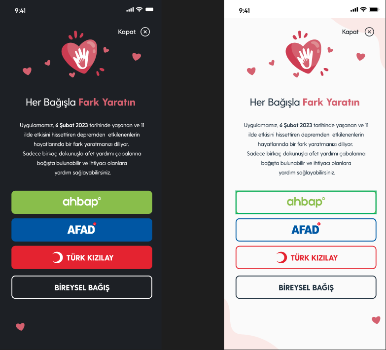

# iDonateAlert

iDonateAlert iOS SDK to show donation alerts easily in your app.

## Examples
<p align="center">
  
</p>


## Requirements
* iOS 11.0+
* Xcode 14+
* Swift 5.7+

## Installation
iDonateAlert is distributed with [Swift Package Manager](https://swift.org/package-manager/). You can add framework to your project from Xcode's `File > Swift Packages > Add Package Dependency` menu with its github URL:
```
https://github.com/mobven/iDonateAlert.git
```

## Usage
iDonateAlert can be initialized

