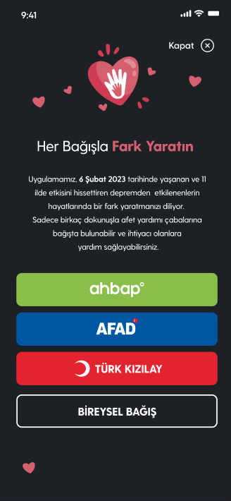
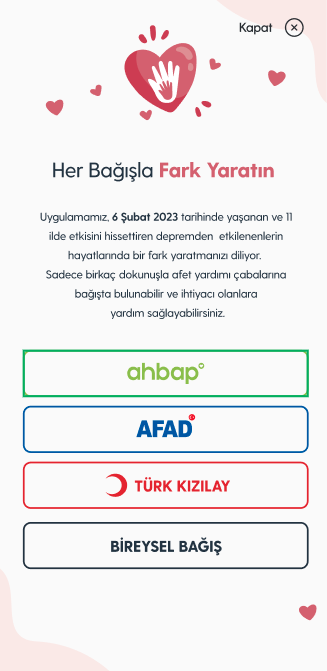

# iDonateAlert
<!-- ALL-CONTRIBUTORS-BADGE:START - Do not remove or modify this section -->
[](#contributors-)
<!-- ALL-CONTRIBUTORS-BADGE:END -->

iDonateAlert iOS SDK to show donation alerts easily in your app.

## Examples
<p align="center">
  
  
</p>


## Requirements
* iOS 11.0+
* Xcode 14+
* Swift 5.7+

## Installation
iDonateAlert is distributed with [Swift Package Manager](https://swift.org/package-manager/). You can add framework to your project from Xcode's `File > Swift Packages > Add Package Dependency` menu with its github URL:
```
https://github.com/mobven/iDonateAlert.git
```

## Usage
### Default initializer
iDonateAlert can be initialized through, which has default title and message those are presented in the screenshot above.
```swift
let alert = iDonateAlert()
alert.present(over: self)
```

### Custom title, message and icon
If you want to use custom title and message, you can use below initializer. You can pass `icon` to use custom icon.    
```swift 
let alert = iDonateAlert(title: "Donate", message: "Donation lorem impsum...")
alert.present(over: self)
```

### Attributed title and message, and custom icon
You can use `.init(attributedTitle:, attributedMessage:)` to use attributed parameters for title and messages including your own fonts. 
```swift    
let attributedTitle = NSAttributedString(string: "Donate")
let attributedMessage = NSAttributedString(string: "Donation lorem impsum...")
let alert = iDonateAlert(attributedTitle: attributedTitle, attributedMessage: attributedMessage)
alert.present(over: self)
```

### Custom Action Buttons
By default it has, AHBAP, AFAD and Turk Kizilayi buttons. If you want to add custom buttons, you can set it via:
```swift
let alert = iDonateAlert()
alert.removeAllActions()
// TODO: add URLS
alert.addAction(.init(title: "INDIVIDUAL DONATION", image: nil))
alert.present(over: self)
```

## Contributors ✨

Thanks goes to these wonderful people ([emoji key](https://allcontributors.org/docs/en/emoji-key)):

<!-- ALL-CONTRIBUTORS-LIST:START - Do not remove or modify this section -->
<!-- prettier-ignore-start -->
<!-- markdownlint-disable -->
<table>
  <tbody>
    <tr>
      <td align="center" valign="top" width="14.28%"><a href="https://github.com/NOTB4D"><br /><sub><b>Eser Kucuker</b></sub></a><br /><a href="#infra-NOTB4D" title="Infrastructure (Hosting, Build-Tools, etc)">🚇</a> <a href="https://github.com/mobven/iDonateAlert/commits?author=NOTB4D" title="Tests">⚠️</a> <a href="https://github.com/mobven/iDonateAlert/commits?author=NOTB4D" title="Code">💻</a></td>
    </tr>
  </tbody>
</table>

<!-- markdownlint-restore -->
<!-- prettier-ignore-end -->

<!-- ALL-CONTRIBUTORS-LIST:END -->

This project follows the [all-contributors](https://github.com/all-contributors/all-contributors) specification. Contributions of any kind welcome!